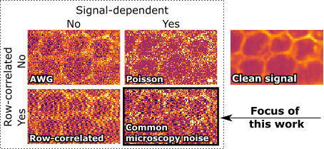

# [Unsupervised Denoising for Signal-Dependent and Row-Correlated Imaging Noise](https://arxiv.org/abs/2310.07887)<br>
## COSDD (COrrelated and Signal-Dependent Denoising)
<sup>1</sup>Benjamin Salmon and <sup>2</sup>Alexander Krull<br>
<sup>1, 2</sup>University of Birmingham<br>
<sup>1</sup>brs209@student.bham.ac.uk, <sup>2</sup>a.f.f.krull@bham.ac.uk<br>
This project includes code from the [ladder-vae-pytorch](https://github.com/addtt/ladder-vae-pytorch) project, which is licensed under the MIT License.





Abstract. Accurate analysis of microscopy images is hindered by the presence of noise. This noise is usually signal-dependent and often additionally correlated along rows or columns of pixels. Current self- and unsupervised denoisers can address signal-dependent noise, but none can reliably remove noise that is also row- or column-correlated. Here, we present the first fully unsupervised deep learning-based denoiser capable of handling imaging noise that is row-correlated as well as signal-dependent. Our approach uses a Variational Autoencoder (VAE) with a specially designed autoregressive decoder. This decoder is capable of modeling row-correlated and signal-dependent noise but is incapable of independently modeling underlying clean signal. The VAE therefore produces latent variables containing only clean signal information, and these are mapped back into image space using a proposed second decoder network. Our method does not require a pre-trained noise model and can be trained from scratch using unpaired noisy data. We show that our approach achieves competitive results when applied to a range of different sensor types and imaging modalities.

### BibTeX
```
@misc{salmon2024unsupervised,
      title={Unsupervised Denoising for Signal-Dependent and Row-Correlated Imaging Noise}, 
      author={Benjamin Salmon and Alexander Krull},
      year={2024},
      eprint={2310.07887},
      archivePrefix={arXiv},
      primaryClass={eess.IV}
}
```
